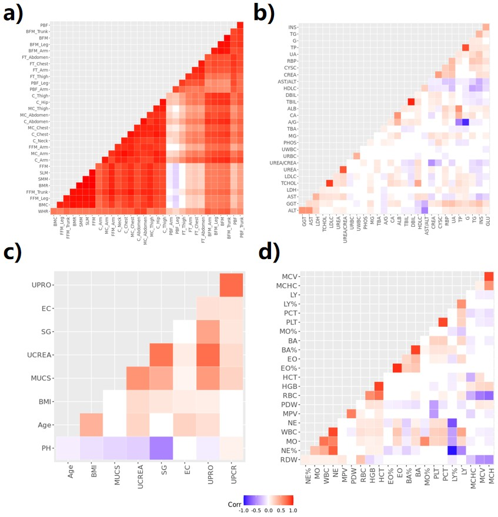
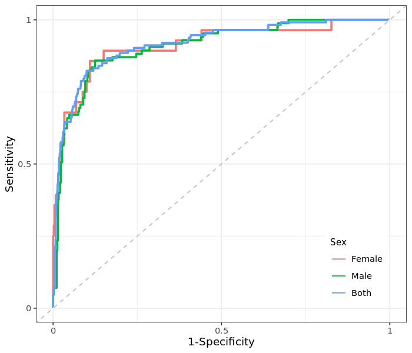
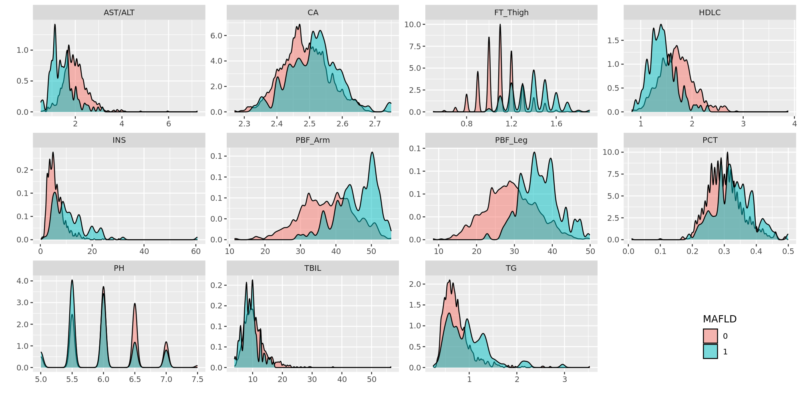

Overview
=============================================

In 2022, the Children's Hospital from Jiangnan University estabilished a children cohort in China, Wuxi, namely Jinqiao cohort.  

The primary aim of the cohort is to follow-up the characteristics and risk factor of metabolic diseases (mainly MAFLD).  

We collected a wide range of biomakers, including some are less-explored previously.  

To investigate if there are novel biomarkers underlying MAFLD, we perform a association study.  

We made our R code available, for peer review.  

Data access
=======================
To access the data, please contact Dr Le Zhang, via zhangle@jiangnan.edu.cn.   

Analysis: preparation
=======================
Load packages:

.. code-block:: python

   libs <- c("dplyr", "tidyr", "ggplot2", "ggpubr", "ggsci", "psych", "ggcorrplot", "corrplot", "pROC", "plotROC")
   lapply(libs, require, character.only = TRUE)
   options(stringsAsFactors = F)
   

Define functions for proportion description:

.. code-block:: python

   # calculate proportion of a given var for all, male, female participants
   # e.g,
   # temp = data.frame(sex=c('Male', 'Female'), MAFLD=c(1, 0))
   # get_prop(temp, 'sex', 'MAFLD')
   get_prop <- function(df, col, group_col) {
      for (group in c("0|1", "1", "0")) {
         sub <- df[grepl(group, df[, group_col]), ]
         tab <- table(sub[, col])
         frq <- data.frame(col = names(tab), n = as.numeric(tab))
         frq <- frq %>% mutate(n = paste0(n, "(", sprintf("%.2f", n * 100 / sum(tab)), "%)"))
         group1 <- case_when(group == "0|1" ~ "all", group == "1" ~ group_col, group == "0" ~ paste0("non-", group_col))
         print(paste0("distribution of ", group1, " participants :"))
         print(frq)
      }
   }

Analysis: data cleaning 
=============================================

Here we clean the raw dataset (remove redundancy variables, and recodes the variables, etc). 

.. code-block:: python

   # load df
   load("path_of_data")
   # inbody, drop right
   df <- df[, !grepl("FFM%|.Right", names(df))]
   names(df) <- gsub(".", "_", names(df), fixed = T)
   names(df) <- gsub("_of_", "_", names(df), fixed = T)
   names(df) <- gsub("Left_", "", names(df), fixed = T)
   names(df) <- gsub("Circumference", "C", names(df), fixed = T)
   names(df) <- gsub("Muscle_C", "MC", names(df))
   names(df) = gsub("Fat_Thickness", "FT", names(df))

   df = df %>%
      select(-BMI) %>%
      mutate(BMI = as.numeric(weight) / ((as.numeric(height) / 100)^2), sex = ifelse(sex == "男", "m", "f"), Month = round(age * 12)) %>%
      rename(Age = age, Sex = sex)

   bmi_criteria <- read.csv("who_overweight_ref.csv") %>%
      select(sex, Month, SD2neg, SD1, SD2) %>%
      rename(Sex = sex)
   df <- df %>% merge(bmi_criteria, by = c("Month", "Sex"), all.x = T)

   inbody_biomakers <- c("SLM", "SMM", "BMR", "WHR", "BMC", get("FFM|PBF|BFM|Circum|MC_|FT_", names(df)))

   biomakers <- c(inbody_biomakers, names(df)[which(names(df) == "INS"):which(names(df) == "PDW")]) # all biomarkers
   cat_biomarkers <- c("ERY", "URO", "PRO", "LEU", "VC", "UCA") # categorical biomarkers
   num_biomarkers <- biomakers[!biomakers %in% cat_biomarkers] # numeric biomarkers

   ## recode
   # bmi, orinal values according to who criteria
   df <- df %>%
      mutate(bmi = ifelse(BMI > SD1 & BMI < SD2, 1, ifelse(BMI > SD2, 2, 0)))
   # cat_biomarkers, convert to orinal values
   for (col in cat_biomarkers) {
      print(col)
      cat("before recode:\n")
      print(table(df[, col]))
      var = df[, col]
      if (col == "UCA") {
         var1 = case_when(var == "<1.00" ~ 0, var == "2.5" ~ 1, var == "5" ~ 2)
      } else if (col == "URO") {
         var1 = case_when(var == "阴性" ~ 0, var == "阳性+" ~ 1, var == "阳性++" ~ 2)
      } else {
         var1 = case_when(var == "阴性" ~ 0, var == "弱阳性" ~ 1, var == "阳性+" ~ 2, var == "阳性++" ~ 3, var == "阳性+++" ~ 4)
      }
      df[, col] = var1
      cat("after recode:\n")
      print(table(df[, col]))
   }
   

Analysis: description of population characteristics  
=============================================
Here we measure the distribution of categorical biomarkers by proportion and that of numeric ones by mean and sd.  
Distribution comparison was conducted according to data type.

.. code-block:: python

   ## distribution description
   # categorical biomarkers, n and proportion
   for (col in c("grade", "Sex", "BMI", cat_biomarkers)) {
      print(col)
      get_prop(df, col, group_col = "MAFLD")
   }

   # numeric biomarkers, mean, sd, iqr
   describe(df[, c("Age", num_biomarkers)])
   describeBy(df[, c("Age", num_biomarkers)], list(df$MAFLD))

   ## distribution comparison
   # fisher test
   for (var in c("grade", "Sex", "BMI", cat_biomarkers)) {
      print(var)
      print(fisher.test(table(df[, var], df$MAFLD), simulate.p.value = TRUE)) # here change to fisher test
   }

   # wilcox test
   for (var in c("Age", num_biomarkers)) {
      print(var)
      shapiro = shapiro.test(df[, var])
   if (shapiro$p.value < 0.05) {
      test = wilcox.test(df[, var] ~ df$MAFLD)
   } else {
      test = t.test(df[, var] ~ df$MAFLD)
   }
      print(test)
   }

Analysis: correlation within biomarkers 
=============================================
Here we use a correlation matrix to measure the corrlation within biomakrers.  

.. code-block:: python

   vars1 = c(names(df)[which(names(df) == "BFM"):which(names(df) == "FT_Thigh")])
   vars2 <- c(names(df)[which(names(df) == "INS"):which(names(df) == "UWBC")])
   vars3 <- c("Age", "BMI", "UPRO", "UPCR", "UCREA", "SG", "PH", "EC", "MUCS")
   vars4 <- c(names(df)[which(names(df) == "WBC"):which(names(df) == "PDW")])

   plots <- list()
   for (i in 1:4) {
   keep_col <- base::get(paste0("vars", i))
   sub <- df[, keep_col]
   mat_cor <- cor(sub)
   mat_p <- corr.test(sub, adjust = "none")[["p"]]
   p <- ggcorrplot(mat_cor,p.mat = mat_p, type = "lower", hc.order = T, insig = "blank", outline.col = "white",
      ggtheme = ggplot2::theme_gray) +
      theme(axis.text.x = element_text(angle = 90, hjust = 1))
      plots[[i]] <- p
   }

   png("plot/cor1.png", height = 800, width = 800, res = 80)
   plots[[1]]
   dev.off()

   png("plot/cor2.png", height = 700, width = 700, res = 80)
   plots[[2]]
   dev.off()

   png("plot/cor3.png", height = 600, width = 1200, res = 100)
   ggarrange(plots[[3]], plots[[4]],
      nrow = 1, ncol = 2, hjust = 0.1, vjust = 0.1,
      common.legend = T, legend = "bottom")
   dev.off()

Analysis: associations between biomakers and MAFLD
=============================================
Here we use regression to measure the association between biomarkers and MAFLD.

First, for each biomarker, we measure its association with MAFLD, including age and sex as covariates.

.. code-block:: python

   res <- data.frame()
   for (biomaker in biomakers) {
      reg <- glm(df$MAFLD ~ df[, biomaker] + df$Age + df$Sex, df, family = binomial()) # I add age and sex here.
      coef <- data.frame(summary(reg)$coefficients)
      coef <- coef[2, c(1, 2, 4)]
      coef <- c(biomaker, coef)
      names(coef) <- c("biomarker", "beta", "se", "p")
      res <- rbind(res, coef)
   }

   vars <- unname(unlist(res %>% filter(p < 0.05) %>% select(biomarker)))
   sub <- df[, c("MAFLD", vars)]

   reg <- glm(MAFLD ~ ., family = binomial(), data = sub)
   summary(reg)
   reg1 <- step(reg)
   coef1 <- data.frame(summary(reg1)$coefficients)
   coef1 <- coef1[2:nrow(coef1), c(1, 2, 4)]
   coef1 <- cbind(rownames(coef1), coef1)
   names(coef1) <- c("biomarker", "beta", "se", "p")
   row.names(coef1) <- NULL

Then, for those with significant p-value in univariate analysis (also with age and sex as covariates), we perform multivariates analysis with a step-wise for variable selection. 

.. code-block:: python

   vars <- unname(unlist(res %>% filter(p < 0.05) %>% select(biomarker)))
   sub <- df[, c("MAFLD", vars)]

   reg <- glm(MAFLD ~ ., family = binomial(), data = sub)
   summary(reg)
   reg1 <- step(reg)
   coef1 <- data.frame(summary(reg1)$coefficients)
   coef1 <- coef1[2:nrow(coef1), c(1, 2, 4)]
   coef1 <- cbind(rownames(coef1), coef1)
   names(coef1) <- c("biomarker", "beta", "se", "p")
   row.names(coef1) <- NULL

We generate ROC plot, for each sex.

.. code-block:: python

   df$pred <- predict(reg1, type = "response")

   df1 <- df %>%
   mutate(Sex = ifelse(Sex == "m", "Male", "Female")) %>%
   select(Sex, pred, MAFLD)
   df2 <- df %>%
   mutate(Sex = "Both") %>%
   select(Sex, pred, MAFLD)
   df_p <- rbind(df1, df2) %>% mutate(Sex = factor(Sex, levels = c("Female", "Male", "Both")))

   p <- ggplot(df_p, aes(d = MAFLD, m = pred, color = Sex)) +
   geom_roc(n.cuts = 0) +
   style_roc() +
   geom_abline(intercept = 0, slope = 1, linetype = "dashed", color = "gray") +
   scale_x_continuous(breaks = c(0, 0.5, 1), labels = c(0, 0.5, 1)) +
   scale_y_continuous(breaks = c(0, 0.5, 1), labels = c(0, 0.5, 1)) +
   theme(legend.position = c(0.95, 0.05), legend.justification = c(1, 0), legend.title = element_text(size = 9)) +
   labs(x = "1-Specificity", y = "Sensitivity")

   calc_auc(p)[, 3:4]

   png("plot/roc.png", height = 600, width = 700, res = 180)
   p
   dev.off()

The distribution difference of variables retain in multivariates regression is shown with density plot.

.. code-block:: python

   vars <- names(reg1$coefficients)[-1]
   vars <- gsub("`", "", vars)
   df_p <- df[, c(vars, "MAFLD")]
   df_p <- df_p %>%
   gather(variable, value, -MAFLD) %>%
   mutate(MAFLD = as.character(MAFLD))

   p <- ggplot(df_p, aes(x = value, group = MAFLD, fill = MAFLD)) +
   geom_density(alpha = 0.5, , adjust = 0.3) +
   facet_wrap(~variable, scales = "free") +
   scale_y_continuous(labels = function(x) sprintf("%.1f", x)) +
   xlab("") +
   ylab("") +
   theme(
      legend.position = c(0.9, 0.1),
      legend.box = "inside"
   )

   png("plot/density.png", height = 1000, width = 2000, res = 160)
   print(p)
   dev.off()

Comments and feedbacks
=======================

Feel free to contact me via zhanghaoyang0@hotmail.com.  

You may star our project at `here <https://github.com/zhanghaoyang0/jinqiao_cohort>`_.  