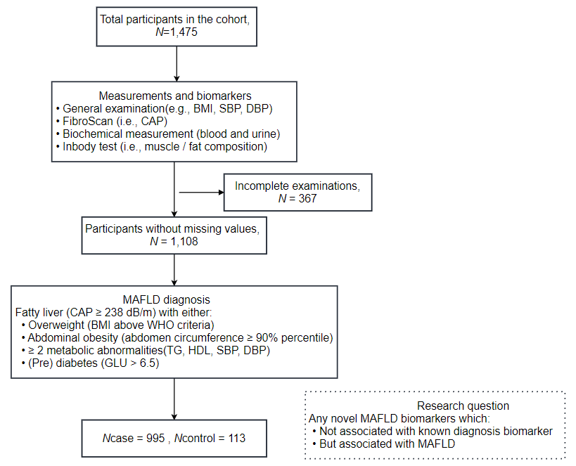
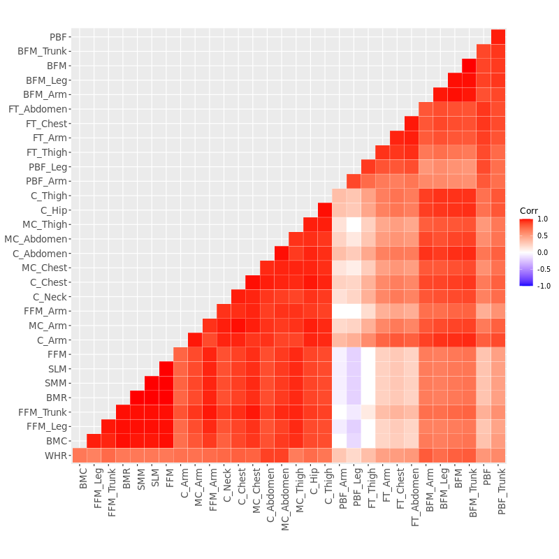

Overview
=============================================

In 2022, Jiangnan University initialized a children MAFLD cohort in China, Wuxi, namely Jinqiao cohort.  
Here is a study based on this cohort. Our objective is to investigate the potential novel association between MAFLD and certain lesser-explored biomarkers.  
These biomarkers, which are not currently used as diagnostic markers and are not known to be associated with established diagnostic markers,  
could provide insights into our understanding of MAFLD.
Below is our analysis pipeline.

Data access
=======================
Contact Le Zhang via zhangle@jiangnan.edu.cn

Preparation and data cleaning
=======================
Load packages:

.. code-block:: python

   libs <- c("dplyr", "tidyr", "ggplot2", "ggpubr", "ggsci", "psych", "ggcorrplot", "corrplot", "pROC", "plotROC")
   lapply(libs, require, character.only = TRUE)
   options(stringsAsFactors = F)
   

Define functions:

.. code-block:: python

   ## extract element with pattern from vector
   # e.g., get('a', c('AS', 'Ba', 'C')) ; get('a', c('AS', 'Ba', 'C'), exact=F)
   get <- function(key, vec, exact = F, v = F) {
   vec <- unlist(vec)
   if (exact == T) {
      out <- vec[grep(key, vec, invert = v)]
   } else {
      out <- vec[grep(toupper(key), toupper(vec), invert = v)]
   }
   return(out)
   }

   # calculate proportion of a given var for all, male, female participants
   # e.g,
   # temp = data.frame(sex=c('Male', 'Female'), MAFLD=c(1, 0))
   # get_prop(temp, 'sex', 'MAFLD')
   get_prop <- function(df, col, group_col) {
   for (group in c("0|1", "1", "0")) {
      sub <- df[grepl(group, df[, group_col]), ]
      tab <- table(sub[, col])
      frq <- data.frame(col = names(tab), n = as.numeric(tab))
      frq <- frq %>% mutate(n = paste0(n, "(", sprintf("%.2f", n * 100 / sum(tab)), "%)"))
      group1 <- case_when(group == "0|1" ~ "all", group == "1" ~ group_col, group == "0" ~ paste0("non-", group_col))
      print(paste0("distribution of ", group1, " participants :"))
      print(frq)
   }
   }

Clean the raw dataset (remove redundancy variables, and recodes the variables, etc). 

.. code-block:: python

   # load df
   load("path_of_data")
   # inbody, drop right
   df <- df[, !grepl("FFM%|.Right", names(df))]
   names(df) <- gsub(".", "_", names(df), fixed = T)
   names(df) <- gsub("_of_", "_", names(df), fixed = T)
   names(df) <- gsub("Left_", "", names(df), fixed = T)
   names(df) <- gsub("Circumference", "C", names(df), fixed = T)
   names(df) <- gsub("Muscle_C", "MC", names(df))
   names(df) = gsub("Fat_Thickness", "FT", names(df))

   df = df %>%
   mutate(BMI = as.numeric(weight) / ((as.numeric(height) / 100)^2), sex = ifelse(sex == "男", "m", "f"), Month = round(age * 12)) %>%
   rename(Age = age, Sex = sex)

   ## recode
   # bmi, orinal values according to who criteria
   vars <- names(df)[which(names(df) == "SBP"):which(names(df) == "PDW")] # all vars
   cat_vars <- c('Sex', "ERY", "URO", "PRO", "LEU", "VC", "UCA") # categorical
   num_vars <- c('Age', vars[!vars %in% cat_vars]) # numeric
   diagnosis_vars = c('BMI', 'SBP', 'DBP', 'GLU', 'TG', 'HDLC', 'C_Abdomen') # biomarkers used in diagnosed

   ## recode
   # cat_vars, convert to orinal values
   for (col in c("ERY", "URO", "PRO", "LEU", "VC", "UCA")) {
      print(col)
      cat("before recode:\n")
      print(table(df[, col]))
      var = df[, col]
      if (col == "UCA") {
         var1 = case_when(var == "<1.00" ~ 0, var == "2.5" ~ 1, var == "5" ~ 2)
      } else if (col == "URO") {
         var1 = case_when(var == "阴性" ~ 0, var == "阳性+" ~ 1, var == "阳性++" ~ 2)
      } else {
         var1 = case_when(var == "阴性" ~ 0, var == "弱阳性" ~ 1, var == "阳性+" ~ 2, var == "阳性++" ~ 3, var == "阳性+++" ~ 4)
      }
         df[, col] = var1
         cat("after recode:\n")
         print(table(df[, col]))
      }

Analysis: description of population characteristics  
=============================================
Here we measure the distribution of categorical biomarkers by proportion and that of numeric ones by mean and sd.  
Distribution comparison was conducted according to data type.

.. code-block:: python

   ## distribution description
   # categorical biomarkers, n and proportion
   for (col in c("Sex", "BMI", cat_vars)) {
      print(col)
      get_prop(df, col, group_col = "MAFLD")
   }

   # numeric biomarkers, mean, sd, iqr
   describe(df[, num_vars])
   describeBy(df[, num_vars], list(df$MAFLD))

   ## distribution comparison
   # fisher test
   for (var in cat_vars) {
      print(var)
      print(fisher.test(table(df[, var], df$MAFLD), simulate.p.value = TRUE)) # here change to fisher test
   }

   # wilcox test
   for (var in num_vars) {
   print(var)
   shapiro = shapiro.test(df[, var])
   if (shapiro$p.value < 0.05) {
      test = wilcox.test(df[, var] ~ df$MAFLD)
   } else {
      test = t.test(df[, var] ~ df$MAFLD)
   }
      print(test)
   }

Analysis: correlation within biomarkers 
=============================================
Here we identified which biomarker is related with the diagnosis biomarker, and these are not novel.  

.. code-block:: python

   out = c()
   for (i in diagnosis_vars){
   for (j in vars[vars!=i]){
      test = cor.test(df[,i], df[,j], use = "complete.obs")
      cor = test$estimate
      cor_p = test$p.value
      out = c(out, i, j, cor, cor_p)
   }
   }
   res = data.frame(matrix(out, ncol=4, byrow=T))
   names(res) = c('diagnosis_var', 'other_var', 'cor', 'p')
   res = res%>%mutate(cor=as.numeric(cor), p=as.numeric(p))
   res1 = res%>%filter(p<0.05&abs(cor)>0.8)

   plots <- list()
   for (var in unique(res1$diagnosis_var)){
   df_p = res%>%filter(diagnosis_var==!!var)%>%arrange(cor)%>%filter(p<0.05&cor>0.2)%>%
      mutate(cor=abs(cor), diagnosis_var=gsub('_', ' of ', diagnosis_var), other_var=gsub('_', ' of ', other_var))
   df_p = df_p%>%mutate(other_var=factor(other_var, levels=df_p$other_var))
   ylab = paste0('Correlation coefficient with ', ifelse(var=='BMI', 'BMI', 'abdomen circumference'))

   p = ggplot(df_p, aes(x=other_var, y=cor))+
      geom_bar(stat="identity", width=0.7, fill="steelblue") +
      xlab('') + ylab(ylab) + 
      theme(plot.title = element_text(size = 15, face = "bold", hjust = 0.5)) +
      coord_flip()  +
      geom_hline(yintercept = 0.8, color = "black", linetype = 2) +
      scale_fill_manual(values = c("steelblue", "green"), breaks = c(0, 1),
                        labels = c("Correlation < 0.8", "Correlation >= 0.8")) +
      scale_y_continuous(limits = c(0, 1), breaks = seq(0, 1, 0.2))
   plots[[var]] = p
   }

   png("plot/cor1.png", height = 800, width = 1200, res = 100)
   ggarrange(plots[[1]], plots[[2]],
      nrow = 1, ncol = 2, hjust = 0.1, vjust = 0.1)
   dev.off()

   # diagnosis_vars and vars associated with diagnosis_vars 
   drop_vars = unlist(res1[,1:2])

After excluding the above biomarkers (associated with dianosis biomarker), we investigate their pair-wise correlation.

.. code-block:: python

   vars = list()
   vars[['inbody']] = c(names(df)[which(names(df) == "BFM"):which(names(df) == "FT_Thigh")]) # 31
   vars[['blood_biochemical']] = c(names(df)[which(names(df) == "INS"):which(names(df) == "UREA/CREA")]) # 27
   vars[['blood_composition']] = c(names(df)[which(names(df) == "WBC"):which(names(df) == "PDW")]) # 22
   vars[['urine']] = c("URBC", "UWBC", "UPRO", "UPCR", "UCREA", "SG", "PH", "EC", "MUCS") # 9

   plots <- list()
   for (i in names(vars)) {
   keep_col <- vars[[i]]
   keep_col = keep_col[!keep_col%in%drop_vars]
   print(i)
   print(keep_col)
   sub <- df[, keep_col]
   mat_cor <- cor(sub)
   mat_p <- corr.test(sub, adjust = "none")[["p"]]
   p <- ggcorrplot(mat_cor,
      p.mat = mat_p, type = "lower", hc.order = T, insig = "blank", outline.col = "white",
      ggtheme = ggplot2::theme_gray) +
      theme(axis.text.x = element_text(angle = 90, hjust = 1), legend.position='none')
   plots[[i]] <- p
   }

   png("plot/cor_inbody.png", height = 800, width = 1800, res = 100)
   ggarrange(plots[[1]], nrow = 1, ncol = 1, hjust = 0.1, vjust = 0.1, common.legend = T, legend = "bottom")
   dev.off()

   png("plot/cor2.png", height = 800, width = 1800, res = 100)
   ggarrange(plots[[2]], plots[[3]], plots[[4]],
   nrow = 1, ncol = 3, hjust = 0.1, vjust = 0.1,
   common.legend = T, legend = "bottom"
   )
   dev.off()

Analysis: associations between biomakers and MAFLD
=============================================
Here we use regression to measure the association between biomarkers and MAFLD.

First, for each biomarker, we measure its association with MAFLD, including age and sex as covariates.

.. code-block:: python

   biomakers = unlist(vars)
   biomakers = biomakers[!biomakers%in%drop_vars]

   res <- data.frame()
   for (biomaker in biomakers) {
   reg <- glm(df$MAFLD ~ df[, biomaker] + df$Age + df$Sex, df, family = binomial()) # I add age and sex here.
   coef <- data.frame(summary(reg)$coefficients)
   coef <- coef[2, c(1, 2, 4)]
   coef <- c(biomaker, coef)
   names(coef) <- c("biomarker", "beta", "se", "p")
   res <- rbind(res, coef)
   }

   vars <- unname(unlist(res %>% filter(p < 0.05) %>% select(biomarker)))
   sub <- df[, c("MAFLD", vars)]

   reg <- glm(MAFLD ~ ., family = binomial(), data = sub)

   summary(reg)
   reg1 <- step(reg)
   coef1 <- data.frame(summary(reg1)$coefficients)
   coef1 <- coef1[2:nrow(coef1), c(1, 2, 4)]
   coef1 <- cbind(rownames(coef1), coef1)
   names(coef1) <- c("biomarker", "beta", "se", "p")
   row.names(coef1) <- NULL

Then, for those with significant p-value in univariate analysis (also with age and sex as covariates), we perform multivariates analysis with a step-wise for variable selection. 
AUC values were calcuate to measure the efficacy of these novel biomarkers.

.. code-block:: python

   df$pred <- predict(reg1, type = "response")

   df1 <- df %>%
   mutate(Sex = ifelse(Sex == "m", "Male", "Female")) %>%
   select(Sex, pred, MAFLD)
   df2 <- df %>%
   mutate(Sex = "Both") %>%
   select(Sex, pred, MAFLD)
   df_p <- rbind(df1, df2) %>% mutate(Sex = factor(Sex, levels = c("Female", "Male", "Both")))

   p <- ggplot(df_p, aes(d = MAFLD, m = pred, color = Sex)) +
   geom_roc(n.cuts = 0) +
   style_roc() +
   geom_abline(intercept = 0, slope = 1, linetype = "dashed", color = "gray") +
   scale_x_continuous(breaks = c(0, 0.5, 1), labels = c(0, 0.5, 1)) +
   scale_y_continuous(breaks = c(0, 0.5, 1), labels = c(0, 0.5, 1)) +
   theme(legend.position = c(0.95, 0.05), legend.justification = c(1, 0), legend.title = element_text(size = 9)) +
   labs(x = "1-Specificity", y = "Sensitivity")

   calc_auc(p)[, 3:4]

   png("plot/roc.png", height = 600, width = 700, res = 120)
   p
   dev.off()

The distribution difference of variables retain in multivariates regression is shown with density plot.

.. image:: ../../plot/density.png
   :width: 1000
   :align: center

.. code-block:: python

   vars <- names(reg1$coefficients)[-1]
   vars <- gsub("`", "", vars)
   df_p <- df[, c(vars, "MAFLD")]
   df_p <- df_p %>%
   gather(variable, value, -MAFLD) %>%
   mutate(MAFLD = as.character(MAFLD))

   p <- ggplot(df_p, aes(x = value, group = MAFLD, fill = MAFLD)) +
      geom_density(alpha = 0.5, , adjust = 0.3) +
      facet_wrap(~variable, scales = "free") +
      scale_y_continuous(labels = function(x) sprintf("%.1f", x)) +
      xlab("") +
      ylab("") +
      theme(
      legend.position = c(0.9, 0.1),
      legend.box = "inside"
   )

   png("plot/density.png", height = 1000, width = 2000, res = 160)
   print(p)
   dev.off()

Comments and feedbacks
=======================

Find me via zhanghaoyang0@hotmail.com.  